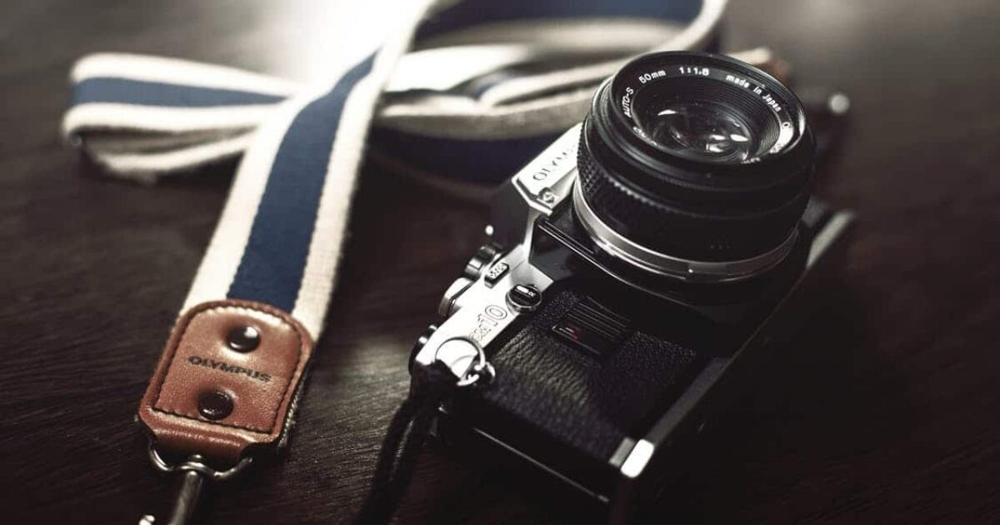

# Project Responsive Web Design using Bootstrap
## Date:13/10/25

## AIM:
To create a simplified clone of Dribbble (https://dribbble.com/) landing page.


## DESIGN STEPS:

### Step 1:
Clone the repository from GitHub.

### Step 2:
Create Django Admin project.

### Step 3:
Create a New App under the Django Admin project.

### Step 4:
Insert the necessary CSS and JavaScript files as external in order to use Bootstrap.

### Step 5:
Create a HTML file and include the needed Bootstrap components.

### Step 6:
Publish the website in the LocalHost.

## PROGRAM :
```
<html lang="en">
<head>
  <meta charset="UTF-8">
  <title>Dribbble Style Page - Dark</title>
  <link href="https://cdn.jsdelivr.net/npm/bootstrap@5.3.2/dist/css/bootstrap.min.css" rel="stylesheet">
</head>
<body style="background-color: #121212; color: #e0e0e0; font-family: 'Segoe UI', Tahoma, Geneva, Verdana, sans-serif;">
  <nav class="navbar navbar-expand-lg bg-black navbar-dark">
    <div class="container-fluid">
      <a class="navbar-brand fw-bold" href="#" style="color: #ff4081; font-size: 14px;">Dribbble</a>
      <div class="collapse navbar-collapse">
        <ul class="navbar-nav ms-3"></ul>
      </div>
    </div>
  </nav>
  <div class="d-flex justify-content-end p-3" style="background-color: #1e1e1e;">
    <a href="#" class="me-3 text-decoration-none" style="color: #ccc;">Sign in</a>
    <a href="#" class="btn text-white" style="background-color: #ff4081;">Sign up</a>
  </div>
  <div class="text-center my-4">
    <h6 class="fw-bold" style="font-size: 22px; color: #ffffff;">What are you working on?</h6>
    <p style="color: #aaa; font-size: 14px;">Dribbble is show and tell for designers.</p>
    <button class="btn me-2 text-white" style="background-color: #555;">Learn more</button>
    <button class="btn text-white" style="background-color: #ff4081;">Sign up</button>
  </div>
  <div class="container">
    <div class="row mb-4">
      <div class="col-2 text-center">
        
        <div class="mt-1" style="font-size: 12px; color: #ccc;">Image 1</div>
      </div>
      <div class="col-2 text-center">
        
        <div class="mt-1" style="font-size: 12px; color: #ccc;">Image 2</div>
      </div>
      <div class="col-2 text-center">
        
        <div class="mt-1" style="font-size: 12px; color: #ccc;">Image 3</div>
      </div>
      <div class="col-2 text-center">
        
        <div class="mt-1" style="font-size: 12px; color: #ccc;">Image 4</div>
      </div>
      <div class="col-2 text-center">
        
        <div class="mt-1" style="font-size: 12px; color: #ccc;">Image 5</div>
      </div>
      <div class="col-2 text-center">
        
        <div class="mt-1" style="font-size: 12px; color: #ccc;">Image 6</div>
      </div>
    </div>
    <div class="row mb-4">
      <div class="col-2 text-center">
        
        <div class="mt-1" style="font-size: 12px; color: #ccc;">Image 7</div>
      </div>
      <div class="col-2 text-center">
        
        <div class="mt-1" style="font-size: 12px; color: #ccc;">Image 8</div>
      </div>
      <div class="col-2 text-center">
        
        <div class="mt-1" style="font-size: 12px; color: #ccc;">Image 9</div>
      </div>
      <div class="col-2 text-center">
        
        <div class="mt-1" style="font-size: 12px; color: #ccc;">Image 10</div>
      </div>
      <div class="col-2 text-center">
        
        <div class="mt-1" style="font-size: 12px; color: #ccc;">Image 11</div>
      </div>
      <div class="col-2 text-center">
        
        <div class="mt-1" style="font-size: 12px; color: #ccc;">Image 12</div>
      </div>
    </div>
    <div class="row mb-4">
      <div class="col-2 text-center">
        
        <div class="mt-1" style="font-size: 12px; color: #ccc;">Image 13</div>
      </div>
      <div class="col-2 text-center">
        
        <div class="mt-1" style="font-size: 12px; color: #ccc;">Image 14</div>
      </div>
      <div class="col-2 text-center">
        
        <div class="mt-1" style="font-size: 12px; color: #ccc;">Image 15</div>
      </div>
      <div class="col-2 text-center">
        
        <div class="mt-1" style="font-size: 12px; color: #ccc;">Image 16</div>
      </div>
      <div class="col-2 text-center">
        
        <div class="mt-1" style="font-size: 12px; color: #ccc;">Image 17</div>
      </div>
      <div class="col-2 text-center">
        
        <div class="mt-1" style="font-size: 12px; color: #ccc;">Image 18</div>
      </div>
    </div>

  </div>

</body>
</html>

```


## OUTPUT:


## RESULT:
The Project for responsive web design using Bootstrap is completed successfully.
